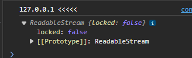

const request = fetch(url);
console.log(request);
    // request es una promesa pendiente

const request = fetch(url).then((data)=>{
        console.log(data.body);
    })

    // data.body me dice que esta bloqueado por una promesa

    

